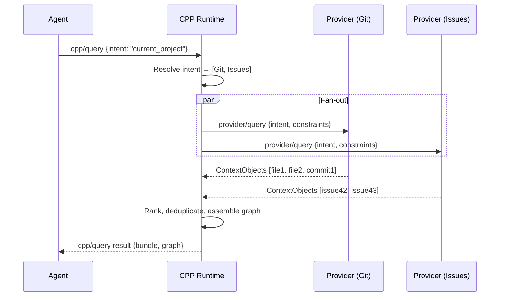
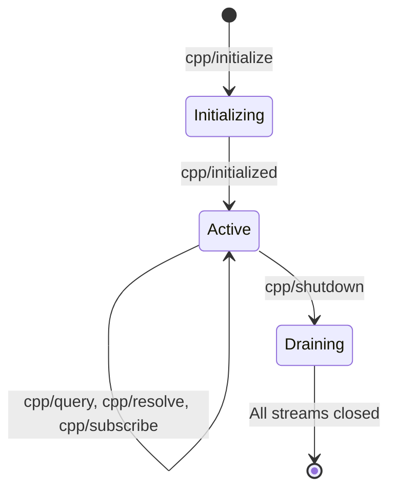
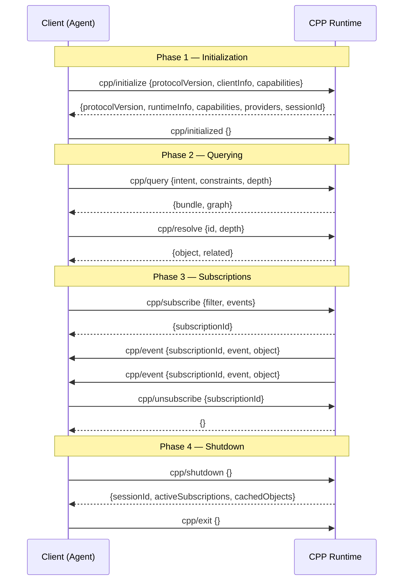

# RFC 0001 — Context Provider Protocol (CPP) Specification

| Field             | Value                                              |
|-------------------|----------------------------------------------------|
| **RFC**           | 0001                                               |
| **Title**         | Context Provider Protocol (CPP)                    |
| **Author**        | Jas                                                |
| **Status**        | Draft                                              |
| **Created**       | 2025-07-13                                         |
| **Protocol Version** | `2025-07-13`                                    |
| **Category**      | Standards Track                                    |
| **Abstract**      | A protocol for semantic context delivery to AI agents |

---

## 1. Abstract

The Context Provider Protocol (CPP) is a protocol enabling AI agents to request
semantic context from heterogeneous data sources through a unified, intent-based
query model. CPP defines a standard wire protocol, a query language, a context
object schema, and a provider discovery mechanism that together allow any
compliant agent to obtain structured, ranked, and relationally linked context
from any compliant provider — without coupling to the provider's internal
representation or API surface.

CPP occupies a distinct position in the AI infrastructure stack: HTTP delivers
documents, OAuth delivers identity, MCP delivers tools, and **CPP delivers
context**. Where MCP answers *"What can I do?"*, CPP answers *"What do I need
to know?"*

---

## 2. Status of This Document

This document specifies a protocol for the Internet and AI agent community and
requests discussion and suggestions for improvement.

### 2.1 Requirements Language

The key words "MUST", "MUST NOT", "REQUIRED", "SHALL", "SHALL NOT", "SHOULD",
"SHOULD NOT", "RECOMMENDED", "NOT RECOMMENDED", "MAY", and "OPTIONAL" in this
document are to be interpreted as described in [BCP 14](https://www.rfc-editor.org/info/bcp14)
[RFC 2119](https://www.rfc-editor.org/rfc/rfc2119) [RFC 8174](https://www.rfc-editor.org/rfc/rfc8174)
when, and only when, they appear in ALL CAPITALS, as shown here.

### 2.2 Versioning

The protocol version is a date string in the format `YYYY-MM-DD`. The current
protocol version is `2025-07-13`. Implementations MUST include the protocol
version in the initialization handshake. A runtime MUST reject clients
advertising an unsupported protocol version.

---

## 3. Introduction

### 3.1 Problem Statement

Modern AI agents require rich, structured context before they can reason
effectively. An agent tasked with resolving a software bug needs the relevant
source files, recent commit history, related issues, team ownership data, and
deployment status — all before it invokes a single tool. Today, agents obtain
this context through ad-hoc API calls, tightly coupling each agent to the
internal interfaces of every data source it consumes. This coupling creates
three systemic problems:

1. **Fragility.** Every upstream API change breaks dependent agents.
2. **Redundancy.** Every agent re-implements the same data-fetching logic.
3. **Opacity.** There is no standard way to describe, discover, or rank the
   context an agent has consumed.

### 3.2 Solution

CPP introduces a protocol layer that abstracts context delivery behind a
uniform interface. Agents express *intent* — a declarative description of the
context they need — and the CPP Runtime resolves that intent by querying
registered Context Providers, assembling a Context Graph, and returning ranked
Context Objects to the agent. Agents never communicate with providers directly.

### 3.3 Relationship to MCP

The Model Context Protocol (MCP) and CPP are complementary:

| Concern        | MCP                          | CPP                              |
|----------------|------------------------------|----------------------------------|
| **Purpose**    | Expose tools and resources   | Deliver structured context       |
| **Direction**  | Agent → Tool execution       | Agent ← Context delivery         |
| **Primitive**  | Tool, Resource, Prompt       | ContextObject, Intent, Relation  |
| **Query model**| Direct invocation            | Intent-based semantic query      |
| **Graph model**| Flat resource list           | Relational context graph         |

An agent MAY use MCP to discover and invoke tools while simultaneously using
CPP to obtain the context those tools require. The two protocols share a common
wire format (JSON-RPC 2.0) to minimize integration friction.

### 3.4 Design Goals

1. **Transport-agnostic.** CPP MUST operate over stdio, HTTP+SSE, and WebSocket.
2. **Schema-first.** Every protocol message is fully specified as a JSON Schema.
3. **Intent-driven.** Agents declare what they need, not how to get it.
4. **Graph-native.** Context objects are nodes in a typed, traversable graph.
5. **Progressive disclosure.** Simple queries return simple results; depth is opt-in.
6. **Secure by default.** Capability-based permissions with explicit access levels.

---

## 4. Terminology

The following terms are used throughout this specification:

**Access Level**
: One of five hierarchical permission tiers (`none`, `metadata`, `read`,
  `write`, `admin`) that govern what operations a session may perform on a
  context object or provider.

**Capability**
: A named feature that a client, runtime, or provider declares support for
  during initialization (e.g., `subscriptions`, `cql.functions`, `graph.traverse`).

**Context Bundle**
: An ordered collection of Context Objects returned as a single response to a
  `cpp/query` request, including pagination metadata and aggregate relevance scores.

**Context Graph**
: The directed, typed graph formed by Context Objects (nodes) and Relations
  (edges) within a session. The graph is materialized incrementally as queries
  are resolved.

**Context Object**
: The atomic unit of context in CPP. A JSON structure containing identity,
  semantic type, payload, metadata, and relationship declarations. Defined
  fully in Section 9.

**Context Pipeline**
: The ordered sequence of resolution stages (discovery, query fan-out,
  ranking, deduplication, assembly) that the runtime executes to fulfill a
  `cpp/query` request.

**Context Provider**
: A service that implements the CPP Provider interface and exposes context
  objects from one or more data sources. Providers register with a runtime via
  a manifest.

**Context Query Language (CQL)**
: The declarative constraint language used in `cpp/query` requests to express
  filtering, ranking, and traversal criteria. Defined fully in Section 8.

**Context Resolver**
: The runtime component responsible for mapping an intent to a set of
  providers, dispatching queries, and assembling the result Context Bundle.

**Context Runtime**
: The orchestration layer between agents and providers. The runtime manages
  provider registration, query dispatch, result ranking, caching, and
  session lifecycle.

**Context Stream**
: A persistent, server-pushed channel over which the runtime delivers
  context events (created, updated, invalidated, expired) to subscribed clients.

**Discovery Service**
: A mechanism (file-based or network-based) by which a runtime locates and
  registers Context Providers.

**Intent**
: A string identifying the semantic purpose of a context query (e.g.,
  `"current_project"`, `"recent_activity"`, `"user_preferences"`). Intents
  allow providers to tailor their response to the agent's goal.

**Manifest**
: A JSON document published by a Context Provider that declares its
  supported intents, semantic types, capabilities, and access requirements.
  Defined fully in Section 11.

**Provider Registry**
: The runtime's internal catalog of registered providers and their manifests.

**Ranking Policy**
: A named strategy (e.g., `"relevance"`, `"recency"`, `"importance"`) that
  the runtime applies to order context objects within a bundle.

**Relation**
: A typed, directed edge between two Context Objects in the Context Graph.
  Relations carry a type label and optional metadata. The full taxonomy is
  defined in Section 10.

**Semantic Type**
: A URI-style identifier classifying the domain kind of a context object
  (e.g., `"cpp:file"`, `"cpp:issue"`, `"cpp:person"`). Semantic types enable
  providers and agents to agree on schema expectations without sharing code.

**Session**
: A stateful conversation between a client and a runtime, established via
  `cpp/initialize` and terminated via `cpp/shutdown`. Sessions scope caching,
  subscriptions, and access control.

---

## 5. Architecture Overview

### 5.1 Three-Tier Model

CPP defines a strict three-tier architecture. Agents MUST NOT communicate with
providers directly; all context flows through the runtime.

```
┌─────────────┐       ┌─────────────────┐       ┌─────────────────┐
│             │       │                 │       │  Context        │
│   Agent     │◄─────►│   CPP Runtime   │◄─────►│  Provider(s)    │
│  (Client)   │       │  (Resolver +    │       │  (Data Sources) │
│             │       │   Registry)     │       │                 │
└─────────────┘       └─────────────────┘       └─────────────────┘
    Tier 1                 Tier 2                    Tier 3
```

### 5.2 Component Responsibilities

| Component        | Responsibilities                                              |
|------------------|---------------------------------------------------------------|
| **Agent**        | Constructs intents, sends CQL queries, consumes context bundles, manages subscriptions |
| **Runtime**      | Manages provider registry, resolves intents to providers, dispatches queries, ranks results, enforces access control, manages caching and sessions |
| **Provider**     | Publishes a manifest, responds to query dispatch, emits context events, enforces data-level access control |

### 5.3 Data Flow



### 5.4 Session Lifecycle



---

## 6. Wire Protocol

### 6.1 Base Protocol

CPP is built on [JSON-RPC 2.0](https://www.jsonrpc.org/specification). All
messages MUST be valid JSON-RPC 2.0 requests, responses, or notifications.

### 6.2 Transport

CPP is transport-agnostic. Implementations MUST support at least one of the
following transports:

| Transport     | Framing                       | Use Case                     |
|---------------|-------------------------------|------------------------------|
| **stdio**     | Newline-delimited JSON (`\n`) | Local processes, CLI agents  |
| **HTTP+SSE**  | HTTP POST (client→runtime), Server-Sent Events (runtime→client) | Web-based agents, remote runtimes |
| **WebSocket** | WebSocket frames              | Persistent bidirectional connections |

For **stdio** transport, each JSON-RPC message MUST be a single line of UTF-8
encoded JSON terminated by a newline character (`U+000A`). Messages MUST NOT
contain embedded newlines.

For **HTTP+SSE** transport:
- Client-to-runtime messages MUST be sent as HTTP POST requests with
  `Content-Type: application/json`.
- Runtime-to-client messages MUST be sent as SSE events with event type
  `message` and `data` containing the JSON-RPC message.
- The SSE endpoint MUST be established during initialization.

For **WebSocket** transport, each WebSocket text frame MUST contain exactly one
JSON-RPC message.

### 6.3 Protocol Version Negotiation

The protocol version string MUST be a date in `YYYY-MM-DD` format. The current
version is `"2025-07-13"`. During initialization, the client and runtime
negotiate the protocol version. The runtime MUST respond with a version it
supports that is less than or equal to the client's requested version. If no
compatible version exists, the runtime MUST respond with error code `-32001`.

### 6.4 Message Ordering

Within a single transport connection, the runtime MUST process requests in the
order they are received. Responses MAY be returned out of order (identified by
their JSON-RPC `id`). Notifications have no `id` and MUST NOT receive a
response.

---

## 7. Protocol Lifecycle

### 7.1 Initialization

The client initiates a session by sending `cpp/initialize`:

**Request:**
```json
{
  "jsonrpc": "2.0",
  "id": 1,
  "method": "cpp/initialize",
  "params": {
    "protocolVersion": "2025-07-13",
    "clientInfo": {
      "name": "my-agent",
      "version": "1.0.0"
    },
    "capabilities": {
      "subscriptions": true,
      "cql": {
        "functions": true,
        "graphTraversal": true
      }
    }
  }
}
```

**Response:**
```json
{
  "jsonrpc": "2.0",
  "id": 1,
  "result": {
    "protocolVersion": "2025-07-13",
    "runtimeInfo": {
      "name": "cpp-runtime",
      "version": "0.1.0"
    },
    "capabilities": {
      "subscriptions": true,
      "cql": {
        "functions": true,
        "graphTraversal": true
      },
      "caching": true,
      "maxDepth": 5
    },
    "providers": [
      {
        "id": "git-provider",
        "name": "Git Context Provider",
        "semanticTypes": ["cpp:file", "cpp:commit", "cpp:branch"],
        "status": "ready"
      },
      {
        "id": "issues-provider",
        "name": "Issue Tracker Provider",
        "semanticTypes": ["cpp:issue", "cpp:label", "cpp:milestone"],
        "status": "ready"
      }
    ],
    "sessionId": "sess_a1b2c3d4"
  }
}
```

After receiving the response, the client MUST send the `cpp/initialized`
notification to signal readiness:

**Notification:**
```json
{
  "jsonrpc": "2.0",
  "method": "cpp/initialized",
  "params": {}
}
```

The runtime MUST NOT send context events or accept queries until it has
received the `cpp/initialized` notification.

### 7.2 Context Query

The core operation of CPP. The client sends a `cpp/query` request expressing
intent, constraints, and traversal parameters:

**Request:**
```json
{
  "jsonrpc": "2.0",
  "id": 2,
  "method": "cpp/query",
  "params": {
    "intent": "current_project",
    "constraints": {
      "recency": "7d",
      "importance": {
        "min": 0.7
      },
      "semanticTypes": ["cpp:file", "cpp:commit"],
      "text": "authentication module"
    },
    "depth": 2,
    "includeRelations": ["contains", "owned_by"],
    "maxResults": 10,
    "accessLevel": "read",
    "rankingPolicy": "relevance"
  }
}
```

**Response:**
```json
{
  "jsonrpc": "2.0",
  "id": 2,
  "result": {
    "bundle": {
      "objects": [
        {
          "id": "ctx_f8e2a1",
          "semanticType": "cpp:file",
          "uri": "file:///src/auth/handler.ts",
          "title": "auth/handler.ts",
          "summary": "HTTP handler for OAuth2 authentication flow",
          "payload": {
            "content": "import { OAuth2Client } from '...';\n// ...",
            "language": "typescript",
            "lineCount": 142
          },
          "metadata": {
            "createdAt": "2025-06-01T10:00:00Z",
            "updatedAt": "2025-07-10T14:32:00Z",
            "importance": 0.92,
            "source": "git-provider"
          },
          "relations": [
            {
              "type": "contains",
              "targetId": "ctx_b3c4d5",
              "metadata": {}
            },
            {
              "type": "owned_by",
              "targetId": "ctx_e6f7a8",
              "metadata": {}
            }
          ],
          "lifecycle": "session",
          "accessLevel": "read"
        }
      ],
      "totalCount": 47,
      "returnedCount": 10,
      "cursor": "eyJwYWdlIjoyfQ==",
      "queryDurationMs": 234
    },
    "graph": {
      "nodes": ["ctx_f8e2a1", "ctx_b3c4d5", "ctx_e6f7a8"],
      "edges": [
        {"source": "ctx_f8e2a1", "target": "ctx_b3c4d5", "type": "contains"},
        {"source": "ctx_f8e2a1", "target": "ctx_e6f7a8", "type": "owned_by"}
      ]
    }
  }
}
```

If a cursor is present, the client MAY paginate by sending:

```json
{
  "jsonrpc": "2.0",
  "id": 3,
  "method": "cpp/query",
  "params": {
    "cursor": "eyJwYWdlIjoyfQ=="
  }
}
```

### 7.3 Context Resolve

Resolves a single context object by its ID, optionally with depth expansion:

**Request:**
```json
{
  "jsonrpc": "2.0",
  "id": 4,
  "method": "cpp/resolve",
  "params": {
    "id": "ctx_f8e2a1",
    "depth": 1,
    "includeRelations": ["contains"]
  }
}
```

**Response:**
```json
{
  "jsonrpc": "2.0",
  "id": 4,
  "result": {
    "object": {
      "id": "ctx_f8e2a1",
      "semanticType": "cpp:file",
      "uri": "file:///src/auth/handler.ts",
      "title": "auth/handler.ts",
      "summary": "HTTP handler for OAuth2 authentication flow",
      "payload": {
        "content": "import { OAuth2Client } from '...';\n// full file content...",
        "language": "typescript",
        "lineCount": 142
      },
      "metadata": {
        "createdAt": "2025-06-01T10:00:00Z",
        "updatedAt": "2025-07-10T14:32:00Z",
        "importance": 0.92,
        "source": "git-provider"
      },
      "relations": [
        {
          "type": "contains",
          "targetId": "ctx_b3c4d5",
          "metadata": {}
        }
      ],
      "lifecycle": "session",
      "accessLevel": "read"
    },
    "related": [
      {
        "id": "ctx_b3c4d5",
        "semanticType": "cpp:function",
        "title": "handleOAuthCallback",
        "summary": "Processes OAuth2 callback and exchanges code for token"
      }
    ]
  }
}
```

### 7.4 Provider Discovery

Clients MAY query the runtime for the current provider registry:

**Request:**
```json
{
  "jsonrpc": "2.0",
  "id": 5,
  "method": "cpp/providers/list",
  "params": {}
}
```

**Response:**
```json
{
  "jsonrpc": "2.0",
  "id": 5,
  "result": {
    "providers": [
      {
        "id": "git-provider",
        "name": "Git Context Provider",
        "version": "1.2.0",
        "semanticTypes": ["cpp:file", "cpp:commit", "cpp:branch", "cpp:diff"],
        "intents": ["current_project", "recent_changes", "file_history"],
        "capabilities": ["cql.functions", "subscriptions"],
        "status": "ready",
        "accessLevel": "read"
      },
      {
        "id": "issues-provider",
        "name": "Issue Tracker Provider",
        "version": "0.9.1",
        "semanticTypes": ["cpp:issue", "cpp:label", "cpp:milestone", "cpp:comment"],
        "intents": ["current_project", "assigned_work", "blockers"],
        "capabilities": ["subscriptions"],
        "status": "ready",
        "accessLevel": "read"
      }
    ]
  }
}
```

### 7.5 Subscriptions

Clients MAY subscribe to context events on specific objects, semantic types, or
intents. Subscriptions require the `subscriptions` capability.

**Subscribe Request:**
```json
{
  "jsonrpc": "2.0",
  "id": 6,
  "method": "cpp/subscribe",
  "params": {
    "filter": {
      "semanticTypes": ["cpp:file"],
      "intents": ["current_project"]
    },
    "events": ["context.created", "context.updated", "context.invalidated"]
  }
}
```

**Subscribe Response:**
```json
{
  "jsonrpc": "2.0",
  "id": 6,
  "result": {
    "subscriptionId": "sub_x1y2z3"
  }
}
```

**Context Event (notification from runtime to client):**
```json
{
  "jsonrpc": "2.0",
  "method": "cpp/event",
  "params": {
    "subscriptionId": "sub_x1y2z3",
    "event": "context.updated",
    "object": {
      "id": "ctx_f8e2a1",
      "semanticType": "cpp:file",
      "title": "auth/handler.ts",
      "metadata": {
        "updatedAt": "2025-07-13T09:15:00Z",
        "importance": 0.95
      }
    },
    "diff": {
      "fields": ["payload.content", "metadata.updatedAt", "metadata.importance"]
    },
    "timestamp": "2025-07-13T09:15:01Z"
  }
}
```

**Unsubscribe Request:**
```json
{
  "jsonrpc": "2.0",
  "id": 7,
  "method": "cpp/unsubscribe",
  "params": {
    "subscriptionId": "sub_x1y2z3"
  }
}
```

### 7.6 Shutdown

**Request:**
```json
{
  "jsonrpc": "2.0",
  "id": 8,
  "method": "cpp/shutdown",
  "params": {}
}
```

**Response:**
```json
{
  "jsonrpc": "2.0",
  "id": 8,
  "result": {
    "sessionId": "sess_a1b2c3d4",
    "activeSubscriptions": 0,
    "cachedObjects": 47
  }
}
```

After receiving the shutdown response, the client SHOULD send the `cpp/exit`
notification and close the transport:

```json
{
  "jsonrpc": "2.0",
  "method": "cpp/exit",
  "params": {}
}
```

### 7.7 Full Lifecycle Sequence



---

## 8. Context Query Language (CQL)

CQL is the declarative constraint language embedded in `cpp/query` requests.
CQL is expressed as a JSON object within the `constraints` field.

### 8.1 Constraint Types

| Constraint        | Type                  | Description                                        |
|-------------------|-----------------------|----------------------------------------------------|
| `recency`         | `string` (duration)   | Maximum age of context objects. Format: `<n>d`, `<n>h`, `<n>m` (days, hours, minutes). |
| `importance`      | `object {min?, max?}` | Numeric range `[0.0, 1.0]` filtering on the object's importance score. |
| `semanticTypes`   | `string[]`            | Restrict results to the listed semantic types.     |
| `text`            | `string`              | Free-text search across title, summary, and payload. |
| `uri`             | `string` (glob)       | URI pattern match (e.g., `"file:///src/auth/**"`). |
| `tags`            | `string[]`            | Objects MUST have ALL listed tags.                 |
| `tagsAny`         | `string[]`            | Objects MUST have AT LEAST ONE of the listed tags. |
| `source`          | `string`              | Restrict results to a specific provider ID.        |
| `createdAfter`    | `string` (ISO 8601)   | Objects created after this timestamp.              |
| `createdBefore`   | `string` (ISO 8601)   | Objects created before this timestamp.             |
| `updatedAfter`    | `string` (ISO 8601)   | Objects updated after this timestamp.              |
| `updatedBefore`   | `string` (ISO 8601)   | Objects updated before this timestamp.             |
| `lifecycle`       | `string`              | One of `"ephemeral"`, `"session"`, `"persistent"`. |
| `accessLevel`     | `string`              | Minimum access level required (see Section 13).    |
| `custom`          | `object`              | Provider-specific constraints. The runtime MUST pass these through to the matching provider. |

### 8.2 Constraint Composition

All top-level constraints are combined with logical AND. To express OR
semantics, use the `$or` operator:

```json
{
  "constraints": {
    "$or": [
      {"semanticTypes": ["cpp:file"], "importance": {"min": 0.8}},
      {"semanticTypes": ["cpp:issue"], "tags": ["critical"]}
    ]
  }
}
```

The `$not` operator negates a constraint set:

```json
{
  "constraints": {
    "semanticTypes": ["cpp:file"],
    "$not": {
      "tags": ["generated", "vendored"]
    }
  }
}
```

### 8.3 CQL Functions

When the `cql.functions` capability is supported, clients MAY use the
following functions within constraints:

| Function                  | Description                                               |
|---------------------------|-----------------------------------------------------------|
| `$contains(field, value)` | True if the array field contains value.                   |
| `$startsWith(field, prefix)` | True if the string field starts with prefix.           |
| `$endsWith(field, suffix)` | True if the string field ends with suffix.               |
| `$regex(field, pattern)`  | True if the string field matches the regex pattern.       |
| `$exists(field)`          | True if the field exists and is non-null.                 |
| `$size(field, op, n)`     | True if the array field's length satisfies `op n` where op ∈ {`eq`, `gt`, `lt`, `gte`, `lte`}. |

**Example with functions:**
```json
{
  "constraints": {
    "semanticTypes": ["cpp:file"],
    "$endsWith": ["uri", ".ts"],
    "$exists": ["payload.content"]
  }
}
```

### 8.4 Sorting and Ranking

The `rankingPolicy` field in a query controls result ordering:

| Policy        | Behavior                                                        |
|---------------|-----------------------------------------------------------------|
| `"relevance"` | Runtime-determined relevance score (DEFAULT).                   |
| `"recency"`   | Most recently updated first.                                    |
| `"importance"`| Highest importance score first.                                 |
| `"alphabetical"` | Sorted by title, ascending.                                |
| `"custom"`    | Provider-defined ranking; requires `rankingParams` object.      |

### 8.5 Pagination

Results are paginated via opaque cursors. The runtime MUST return a `cursor`
string when more results are available. The client resumes pagination by
sending a `cpp/query` with only the `cursor` field set. Cursors MUST remain
valid for at least the duration of the session. Cursors SHOULD be opaque
base64-encoded strings.

---

## 9. Context Object

The Context Object is the atomic unit of context in CPP.

### 9.1 Schema

```json
{
  "id": "string (REQUIRED)",
  "semanticType": "string (REQUIRED)",
  "uri": "string (OPTIONAL)",
  "title": "string (REQUIRED)",
  "summary": "string (OPTIONAL)",
  "payload": "object (OPTIONAL)",
  "metadata": {
    "createdAt": "string (ISO 8601, REQUIRED)",
    "updatedAt": "string (ISO 8601, REQUIRED)",
    "importance": "number [0.0, 1.0] (OPTIONAL, default 0.5)",
    "source": "string (REQUIRED)",
    "tags": "string[] (OPTIONAL)",
    "custom": "object (OPTIONAL)"
  },
  "relations": [
    {
      "type": "string (REQUIRED)",
      "targetId": "string (REQUIRED)",
      "metadata": "object (OPTIONAL)"
    }
  ],
  "lifecycle": "string (OPTIONAL, default 'session')",
  "accessLevel": "string (OPTIONAL, default 'read')",
  "checksum": "string (OPTIONAL, SHA-256 hex)"
}
```

### 9.2 Field Definitions

**`id`** (string, REQUIRED)
: A globally unique identifier for this context object. MUST be stable across
  queries within a session. Implementations SHOULD use a prefixed format
  (e.g., `ctx_<random>`).

**`semanticType`** (string, REQUIRED)
: A URI-style identifier classifying this object's domain kind. Standard
  types are prefixed with `cpp:`. Custom types SHOULD use reverse-domain
  notation (e.g., `com.example:deployment`).

**`uri`** (string, OPTIONAL)
: The canonical URI of the underlying resource, if one exists. MUST be a
  valid URI per [RFC 3986](https://www.rfc-editor.org/rfc/rfc3986).

**`title`** (string, REQUIRED)
: A human-readable short title for this context object. SHOULD be ≤120
  characters.

**`summary`** (string, OPTIONAL)
: A human-readable summary of the object's content. SHOULD be ≤500
  characters.

**`payload`** (object, OPTIONAL)
: The opaque, provider-defined content of this context object. The schema of
  the payload is determined by the `semanticType`. The runtime MUST NOT
  interpret payload contents.

**`metadata`** (object, REQUIRED)
: Structured metadata about this context object. See subfields above.

**`relations`** (array, OPTIONAL)
: An array of Relation objects declaring this object's outgoing edges in the
  Context Graph.

**`lifecycle`** (string, OPTIONAL)
: One of `"ephemeral"`, `"session"`, or `"persistent"`. See Section 15.

**`accessLevel`** (string, OPTIONAL)
: The access level required to read this object. See Section 13.

**`checksum`** (string, OPTIONAL)
: A SHA-256 hex digest of the payload content. Used for cache validation and
  deduplication.

### 9.3 Standard Semantic Types

The following semantic types are defined by this specification. Providers MAY
define additional types using reverse-domain notation.

| Semantic Type       | Description                              |
|---------------------|------------------------------------------|
| `cpp:file`          | A source file or document                |
| `cpp:directory`     | A file system directory                  |
| `cpp:commit`        | A version control commit                 |
| `cpp:branch`        | A version control branch                 |
| `cpp:diff`          | A set of changes between revisions       |
| `cpp:issue`         | A bug, feature request, or task          |
| `cpp:comment`       | A comment on an issue, PR, or document   |
| `cpp:pull_request`  | A pull/merge request                     |
| `cpp:person`        | A user, author, or team member           |
| `cpp:team`          | A group of people                        |
| `cpp:label`         | A tag or label                           |
| `cpp:milestone`     | A project milestone or sprint            |
| `cpp:deployment`    | A deployment event or environment        |
| `cpp:log`           | A log entry or log stream                |
| `cpp:metric`        | A numeric measurement or KPI             |
| `cpp:config`        | A configuration value or file            |
| `cpp:snippet`       | A code snippet or text fragment          |
| `cpp:note`          | A free-form note or annotation           |
| `cpp:conversation`  | A chat message or thread                 |
| `cpp:event`         | A calendar event or scheduled occurrence |

---

## 10. Relationships & Context Graph

### 10.1 Relation Schema

```json
{
  "type": "string (REQUIRED)",
  "targetId": "string (REQUIRED)",
  "metadata": {
    "weight": "number [0.0, 1.0] (OPTIONAL)",
    "since": "string (ISO 8601, OPTIONAL)",
    "description": "string (OPTIONAL)"
  }
}
```

### 10.2 Standard Relation Types

The following 20 relation types are defined by this specification:

| Relation Type       | Inverse              | Description                                     |
|---------------------|----------------------|-------------------------------------------------|
| `contains`          | `contained_by`       | Parent contains child (e.g., directory→file)     |
| `contained_by`      | `contains`           | Child is contained by parent                     |
| `owned_by`          | `owns`               | Object is owned by a person or team              |
| `owns`              | `owned_by`           | Person or team owns the object                   |
| `references`        | `referenced_by`      | Object references another                        |
| `referenced_by`     | `references`         | Object is referenced by another                  |
| `depends_on`        | `depended_on_by`     | Object depends on another for correctness        |
| `depended_on_by`    | `depends_on`         | Object is depended on by another                 |
| `derived_from`      | `derived_to`         | Object was derived or generated from another     |
| `derived_to`        | `derived_from`       | Object was used to derive another                |
| `related_to`        | `related_to`         | Symmetric, untyped association                   |
| `supersedes`        | `superseded_by`      | Object replaces a previous version               |
| `superseded_by`     | `supersedes`         | Object has been replaced by a newer version      |
| `blocks`            | `blocked_by`         | Object blocks progress on another                |
| `blocked_by`        | `blocks`             | Object is blocked by another                     |
| `assigned_to`       | `assigned_from`      | Work item assigned to a person                   |
| `assigned_from`     | `assigned_to`        | Person has been assigned a work item              |
| `authored_by`       | `authored`           | Object was authored by a person                  |
| `authored`          | `authored_by`        | Person authored this object                      |
| `linked_to`         | `linked_to`          | Symmetric, explicitly user-created link          |

### 10.3 Graph Traversal

When `depth > 0` in a query or resolve request, the runtime MUST traverse the
Context Graph up to the specified depth, following only the relation types
listed in `includeRelations`. If `includeRelations` is omitted, ALL relation
types are followed.

The runtime MUST NOT traverse cycles. If a cycle is detected, the runtime MUST
terminate traversal for that path and SHOULD include a `"cycleDetected": true`
flag in the graph response.

### 10.4 Graph Response Schema

```json
{
  "graph": {
    "nodes": ["string (context object IDs)"],
    "edges": [
      {
        "source": "string (source object ID)",
        "target": "string (target object ID)",
        "type": "string (relation type)"
      }
    ],
    "cycleDetected": "boolean (OPTIONAL)"
  }
}
```

---

## 11. Provider Manifest

Every Context Provider MUST publish a manifest document that declares its
capabilities, supported intents, semantic types, and access requirements.

### 11.1 Manifest Schema

```json
{
  "manifestVersion": "1.0",
  "provider": {
    "id": "string (REQUIRED)",
    "name": "string (REQUIRED)",
    "version": "string (semver, REQUIRED)",
    "description": "string (OPTIONAL)"
  },
  "intents": [
    {
      "name": "string (REQUIRED)",
      "description": "string (OPTIONAL)",
      "semanticTypes": ["string"],
      "requiredAccessLevel": "string (OPTIONAL, default 'read')"
    }
  ],
  "semanticTypes": ["string"],
  "capabilities": ["string"],
  "transport": {
    "type": "string (REQUIRED, one of: 'stdio', 'http', 'websocket')",
    "endpoint": "string (OPTIONAL, for http/websocket)"
  },
  "auth": {
    "type": "string (OPTIONAL, one of: 'none', 'bearer', 'oauth2', 'api_key')",
    "scopes": ["string (OPTIONAL)"]
  },
  "rateLimit": {
    "maxRequestsPerMinute": "integer (OPTIONAL)",
    "maxConcurrent": "integer (OPTIONAL)"
  }
}
```

### 11.2 Example Manifest

```json
{
  "manifestVersion": "1.0",
  "provider": {
    "id": "git-provider",
    "name": "Git Context Provider",
    "version": "1.2.0",
    "description": "Provides context from local Git repositories"
  },
  "intents": [
    {
      "name": "current_project",
      "description": "Files and commits in the current working tree",
      "semanticTypes": ["cpp:file", "cpp:commit", "cpp:branch", "cpp:diff"]
    },
    {
      "name": "recent_changes",
      "description": "Commits and diffs from the recent history",
      "semanticTypes": ["cpp:commit", "cpp:diff"],
      "requiredAccessLevel": "read"
    },
    {
      "name": "file_history",
      "description": "Historical changes to a specific file",
      "semanticTypes": ["cpp:commit", "cpp:diff"]
    }
  ],
  "semanticTypes": ["cpp:file", "cpp:commit", "cpp:branch", "cpp:diff"],
  "capabilities": ["cql.functions", "subscriptions"],
  "transport": {
    "type": "stdio"
  },
  "auth": {
    "type": "none"
  },
  "rateLimit": {
    "maxRequestsPerMinute": 120,
    "maxConcurrent": 10
  }
}
```

### 11.3 Manifest Registration

A provider registers with the runtime by one of:

1. **Static configuration.** The runtime reads manifests from a configured
   directory at startup.
2. **Dynamic registration.** The provider sends a `provider/register`
   notification to the runtime after transport establishment.
3. **Discovery service.** The runtime queries a discovery service (see
   Section 14).

---

## 12. Streaming & Subscriptions

### 12.1 Context Events

CPP defines four context event types:

| Event                   | Description                                           |
|-------------------------|-------------------------------------------------------|
| `context.created`       | A new context object has been created by a provider.  |
| `context.updated`       | An existing context object's payload or metadata has changed. |
| `context.invalidated`   | A context object is no longer valid and SHOULD be discarded. |
| `context.expired`       | A context object's lifecycle has ended (TTL expired).  |

### 12.2 Event Delivery

Events are delivered as JSON-RPC notifications from the runtime to subscribed
clients. The runtime MUST deliver events in causal order per object (i.e., a
`context.updated` for object X MUST NOT arrive before the `context.created` for
object X). Cross-object ordering is NOT guaranteed.

### 12.3 Subscription Filters

Subscription filters MAY include:

| Filter Field      | Type       | Description                                  |
|-------------------|------------|----------------------------------------------|
| `semanticTypes`   | `string[]` | Match objects of these types.                |
| `intents`         | `string[]` | Match objects produced by these intents.     |
| `ids`             | `string[]` | Match specific object IDs.                   |
| `sources`         | `string[]` | Match objects from specific providers.       |
| `tags`            | `string[]` | Match objects with these tags.               |

### 12.4 Subscription Lifecycle

Subscriptions are scoped to the session. When a session ends (via
`cpp/shutdown` or transport disconnection), all subscriptions MUST be
automatically cancelled. The runtime SHOULD send a final
`context.invalidated` event for all subscribed objects before closing.

### 12.5 Backpressure

If the client cannot consume events fast enough, the runtime SHOULD buffer
events up to a configurable limit. If the buffer overflows, the runtime MUST
send a `cpp/event` notification with `event: "subscription.overflow"` and MAY
cancel the subscription:

```json
{
  "jsonrpc": "2.0",
  "method": "cpp/event",
  "params": {
    "subscriptionId": "sub_x1y2z3",
    "event": "subscription.overflow",
    "droppedCount": 42,
    "timestamp": "2025-07-13T09:20:00Z"
  }
}
```

---

## 13. Permission Model

### 13.1 Access Levels

CPP defines five hierarchical access levels:

| Level      | Ordinal | Permissions                                         |
|------------|---------|-----------------------------------------------------|
| `none`     | 0       | No access. The object is invisible to the client.   |
| `metadata` | 1       | Client may see `id`, `semanticType`, `title`, and `metadata`, but NOT `payload` or `summary`. |
| `read`     | 2       | Client may read all fields including `payload`.     |
| `write`    | 3       | Client may request mutations on the object (via provider-specific extensions). |
| `admin`    | 4       | Client may modify access control, delete objects, and manage provider configuration. |

### 13.2 Access Enforcement

Access levels are enforced at two boundaries:

1. **Runtime → Client.** The runtime MUST strip fields from context objects
   that exceed the client's access level for that object. For example, a
   client with `metadata` access MUST NOT receive `payload` or `summary`
   fields.

2. **Provider → Runtime.** Providers MUST declare `requiredAccessLevel` per
   intent in their manifest. The runtime MUST NOT dispatch queries to
   providers whose required access level exceeds the session's grant.

### 13.3 Capability Grants

Access levels are granted per session during initialization. The client
declares its requested access level; the runtime responds with the actual
granted level (which MAY be lower than requested).

```json
{
  "capabilities": {
    "maxAccessLevel": "read"
  }
}
```

### 13.4 Per-Object Access Control

Providers MAY set `accessLevel` on individual context objects. When a context
object's `accessLevel` exceeds the session's granted level, the runtime MUST
apply the filtering rules from Section 13.2.

---

## 14. Discovery

### 14.1 File-Based Discovery

The runtime MUST support file-based provider discovery. On startup, the runtime
MUST scan the following locations for manifest files:

| Location                              | Scope            |
|---------------------------------------|------------------|
| `~/.cpp/providers/*.json`             | User-global      |
| `.cpp/providers/*.json`               | Project-local    |
| `$CPP_PROVIDERS_PATH/*.json`          | Environment      |

Each JSON file MUST contain a valid provider manifest (Section 11). The runtime
MUST watch these directories for changes and dynamically register or
deregister providers as manifests are added, modified, or removed.

### 14.2 Network-Based Discovery

The runtime MAY support network-based discovery via a CPP Discovery Service.
The discovery service is an HTTP endpoint that returns a list of provider
manifests:

**Request:**
```
GET /v1/providers?intent=current_project&semanticType=cpp:file
Accept: application/json
```

**Response:**
```json
{
  "providers": [
    {
      "manifestUrl": "https://example.com/cpp/git-provider/manifest.json",
      "status": "active",
      "lastSeen": "2025-07-13T08:00:00Z"
    }
  ]
}
```

### 14.3 Discovery Priority

When multiple discovery mechanisms yield the same provider ID, the runtime MUST
apply the following priority order (highest first):

1. Project-local (`.cpp/providers/`)
2. Environment (`$CPP_PROVIDERS_PATH`)
3. User-global (`~/.cpp/providers/`)
4. Network discovery service

---

## 15. Caching & Context Lifecycle

### 15.1 Lifecycle Types

Every context object has a lifecycle that governs its caching behavior:

| Lifecycle      | Duration         | Behavior                                          |
|----------------|------------------|---------------------------------------------------|
| `ephemeral`    | Single query     | MUST NOT be cached. Discarded after the response is delivered. |
| `session`      | Session duration | Cached for the duration of the session. Invalidated on `cpp/shutdown`. |
| `persistent`   | Cross-session    | Cached across sessions. Requires explicit invalidation or TTL expiry. |

### 15.2 Cache Validation

The runtime SHOULD use the `checksum` field (SHA-256 hex) to validate cached
objects. When a provider returns an object with the same `id` and `checksum` as
a cached entry, the runtime MAY serve the cached version.

### 15.3 TTL (Time-to-Live)

Providers MAY include a `ttl` field (integer, seconds) in the object's
metadata. If present, the runtime MUST expire the cached object after the
specified duration and emit a `context.expired` event to subscribed clients.

```json
{
  "metadata": {
    "ttl": 3600,
    "createdAt": "2025-07-13T08:00:00Z",
    "updatedAt": "2025-07-13T08:00:00Z",
    "importance": 0.6,
    "source": "metrics-provider"
  }
}
```

### 15.4 Cache Invalidation

The runtime MUST invalidate cached objects when:

1. A `context.invalidated` event is received from the provider.
2. A `context.expired` event is emitted due to TTL expiry.
3. The provider that produced the object is deregistered.
4. The session ends (for `session`-lifecycle objects).

---

## 16. Error Handling

### 16.1 Error Response Format

Errors follow the JSON-RPC 2.0 error object format:

```json
{
  "jsonrpc": "2.0",
  "id": 2,
  "error": {
    "code": -32001,
    "message": "Protocol version not supported",
    "data": {
      "requestedVersion": "2099-01-01",
      "supportedVersions": ["2025-07-13"]
    }
  }
}
```

### 16.2 CPP Error Codes

In addition to the standard JSON-RPC 2.0 error codes (-32700 through -32603),
CPP defines the following application-level error codes:

| Code     | Name                        | Description                                                 |
|----------|-----------------------------|-------------------------------------------------------------|
| `-32000` | `ProviderUnavailable`       | The target provider is not registered or is offline.        |
| `-32001` | `ProtocolVersionMismatch`   | No compatible protocol version could be negotiated.         |
| `-32002` | `AccessDenied`              | The session lacks sufficient access level for the operation.|
| `-32003` | `IntentNotFound`            | No registered provider supports the requested intent.       |
| `-32004` | `InvalidConstraint`         | A CQL constraint is syntactically or semantically invalid.  |
| `-32005` | `ObjectNotFound`            | The requested context object ID does not exist.             |
| `-32006` | `SubscriptionLimitExceeded` | The session has exceeded the maximum number of subscriptions.|
| `-32007` | `QueryTimeout`              | The query exceeded the runtime's configured timeout.        |
| `-32008` | `ProviderError`             | A provider returned an unrecoverable error during dispatch. |
| `-32009` | `SessionExpired`            | The session has expired or was invalidated.                 |

### 16.3 Partial Failure

When a `cpp/query` fans out to multiple providers and one or more fail, the
runtime MUST return a successful response containing results from healthy
providers AND a `warnings` array listing the failures:

```json
{
  "jsonrpc": "2.0",
  "id": 2,
  "result": {
    "bundle": {
      "objects": [],
      "totalCount": 12,
      "returnedCount": 12,
      "queryDurationMs": 540
    },
    "warnings": [
      {
        "code": -32000,
        "message": "ProviderUnavailable",
        "provider": "metrics-provider",
        "detail": "Connection refused"
      }
    ]
  }
}
```

---

## 17. Security Considerations

### 17.1 Transport Security

All network transports (HTTP+SSE, WebSocket) SHOULD use TLS 1.3 or later.
Stdio transport is inherently scoped to the local process and does not require
encryption.

### 17.2 Authentication

The runtime SHOULD authenticate clients before establishing a session.
Authentication mechanisms are transport-dependent and out of scope for this
specification. Implementations SHOULD support Bearer tokens and OAuth 2.0.

### 17.3 Provider Sandboxing

The runtime SHOULD isolate providers from each other. A malicious or buggy
provider MUST NOT be able to:

1. Read context objects produced by other providers.
2. Impersonate another provider's identity.
3. Exhaust runtime resources (CPU, memory, file descriptors).

Implementations SHOULD enforce per-provider resource quotas (see `rateLimit`
in the manifest schema).

### 17.4 Context Object Integrity

When a `checksum` field is present on a context object, the runtime SHOULD
verify the checksum against the payload content. If verification fails, the
runtime MUST discard the object and log a warning.

### 17.5 Sensitive Data

Providers MUST NOT include credentials, secrets, or personally identifiable
information (PII) in context object payloads unless the session's access level
is `write` or higher and the provider's manifest explicitly declares the
`sensitive_data` capability. The runtime SHOULD log access to sensitive context
objects for audit purposes.

### 17.6 Injection Attacks

Agents consuming context objects MUST treat all payload content as untrusted.
Context object payloads MUST NOT be directly interpolated into executable code,
shell commands, or SQL queries without sanitization.

### 17.7 Denial of Service

The runtime MUST enforce:

1. Maximum query depth to prevent graph traversal bombs.
2. Maximum result count per query.
3. Maximum concurrent subscriptions per session.
4. Rate limiting per client and per provider.

---

## 18. IANA Considerations

### 18.1 Media Type Registration

This specification defines the following media type:

- **Type name:** application
- **Subtype name:** cpp+json
- **Required parameters:** None
- **Optional parameters:** `version` (protocol version date string)
- **Encoding considerations:** UTF-8
- **Security considerations:** See Section 17
- **Published specification:** This document

### 18.2 URI Scheme

This specification reserves the `cpp://` URI scheme for use in semantic type
identifiers and intent URIs. Registration with IANA is pending.

### 18.3 Well-Known URI

Network-based discovery services SHOULD be accessible at
`/.well-known/cpp-providers`. Registration with IANA is pending.

### 18.4 Port Number

No default port number is requested. Implementations SHOULD use the standard
HTTP/HTTPS ports (80/443) for HTTP+SSE transport and document the port in the
provider manifest.

---

## Appendix A: JSON Schema for Context Object

```json
{
  "$schema": "https://json-schema.org/draft/2020-12/schema",
  "$id": "https://contextprovider.dev/schema/context-object.json",
  "title": "CPP Context Object",
  "type": "object",
  "required": ["id", "semanticType", "title", "metadata"],
  "properties": {
    "id": {
      "type": "string",
      "description": "Globally unique identifier"
    },
    "semanticType": {
      "type": "string",
      "description": "URI-style semantic type identifier"
    },
    "uri": {
      "type": "string",
      "format": "uri",
      "description": "Canonical URI of the underlying resource"
    },
    "title": {
      "type": "string",
      "maxLength": 120,
      "description": "Human-readable short title"
    },
    "summary": {
      "type": "string",
      "maxLength": 500,
      "description": "Human-readable summary"
    },
    "payload": {
      "type": "object",
      "description": "Provider-defined opaque content"
    },
    "metadata": {
      "type": "object",
      "required": ["createdAt", "updatedAt", "source"],
      "properties": {
        "createdAt": {"type": "string", "format": "date-time"},
        "updatedAt": {"type": "string", "format": "date-time"},
        "importance": {"type": "number", "minimum": 0, "maximum": 1},
        "source": {"type": "string"},
        "tags": {"type": "array", "items": {"type": "string"}},
        "ttl": {"type": "integer", "minimum": 0},
        "custom": {"type": "object"}
      }
    },
    "relations": {
      "type": "array",
      "items": {
        "type": "object",
        "required": ["type", "targetId"],
        "properties": {
          "type": {"type": "string"},
          "targetId": {"type": "string"},
          "metadata": {"type": "object"}
        }
      }
    },
    "lifecycle": {
      "type": "string",
      "enum": ["ephemeral", "session", "persistent"],
      "default": "session"
    },
    "accessLevel": {
      "type": "string",
      "enum": ["none", "metadata", "read", "write", "admin"],
      "default": "read"
    },
    "checksum": {
      "type": "string",
      "pattern": "^[a-f0-9]{64}$",
      "description": "SHA-256 hex digest of the payload"
    }
  }
}
```

---

## Appendix B: Method Summary

| Method                | Type          | Direction         | Description                        |
|-----------------------|---------------|-------------------|------------------------------------|
| `cpp/initialize`      | Request       | Client → Runtime  | Initiate session and negotiate capabilities |
| `cpp/initialized`     | Notification  | Client → Runtime  | Signal client readiness            |
| `cpp/query`           | Request       | Client → Runtime  | Query for context objects          |
| `cpp/resolve`         | Request       | Client → Runtime  | Resolve a single object by ID      |
| `cpp/providers/list`  | Request       | Client → Runtime  | List registered providers          |
| `cpp/subscribe`       | Request       | Client → Runtime  | Subscribe to context events        |
| `cpp/unsubscribe`     | Request       | Client → Runtime  | Cancel a subscription              |
| `cpp/event`           | Notification  | Runtime → Client  | Deliver a context event            |
| `cpp/shutdown`        | Request       | Client → Runtime  | Initiate graceful shutdown         |
| `cpp/exit`            | Notification  | Client → Runtime  | Terminate the session              |
| `provider/register`   | Notification  | Provider → Runtime| Dynamic provider registration      |
| `provider/query`      | Request       | Runtime → Provider| Dispatch a query to a provider     |

---

## Appendix C: Standard Capabilities

| Capability            | Declared By      | Description                                   |
|-----------------------|------------------|-----------------------------------------------|
| `subscriptions`       | Client, Runtime, Provider | Support for context event subscriptions |
| `cql.functions`       | Client, Runtime  | Support for CQL function operators            |
| `graph.traverse`      | Client, Runtime  | Support for depth > 0 graph traversal         |
| `caching`             | Runtime          | Runtime supports object caching               |
| `sensitive_data`      | Provider         | Provider may include sensitive payloads       |
| `mutations`           | Provider         | Provider supports write-level operations      |
| `custom_ranking`      | Provider         | Provider supports custom ranking policies     |
| `batch_query`         | Runtime          | Runtime supports batched multi-intent queries |

---

## Appendix D: Comparison with Related Protocols

| Feature               | HTTP/REST        | GraphQL          | MCP              | **CPP**                |
|-----------------------|------------------|------------------|------------------|------------------------|
| Primary purpose       | Document transfer| Data querying    | Tool exposure    | **Context delivery**   |
| Query model           | URL + params     | Schema + query   | Direct invocation| **Intent + CQL**       |
| Graph support         | Via HATEOAS      | Native           | None             | **Native (typed)**     |
| Streaming             | SSE, WebSocket   | Subscriptions    | Notifications    | **Context events**     |
| Discovery             | OpenAPI          | Introspection    | Tool listing     | **Manifests + registry** |
| Agent-optimized       | No               | No               | Yes              | **Yes**                |
| Permission model      | OAuth scopes     | Directives       | Capability-based | **5-level hierarchical** |

---

## Appendix E: Informative References

- [RFC 2119](https://www.rfc-editor.org/rfc/rfc2119) — Key words for use in RFCs
- [RFC 8174](https://www.rfc-editor.org/rfc/rfc8174) — Ambiguity of Uppercase vs Lowercase in RFC 2119
- [RFC 3986](https://www.rfc-editor.org/rfc/rfc3986) — Uniform Resource Identifier (URI): Generic Syntax
- [JSON-RPC 2.0 Specification](https://www.jsonrpc.org/specification)
- [Model Context Protocol (MCP)](https://modelcontextprotocol.io)
- [JSON Schema (2020-12)](https://json-schema.org/draft/2020-12/json-schema-core)
- [Server-Sent Events (SSE)](https://html.spec.whatwg.org/multipage/server-sent-events.html)

---

*End of RFC 0001*
